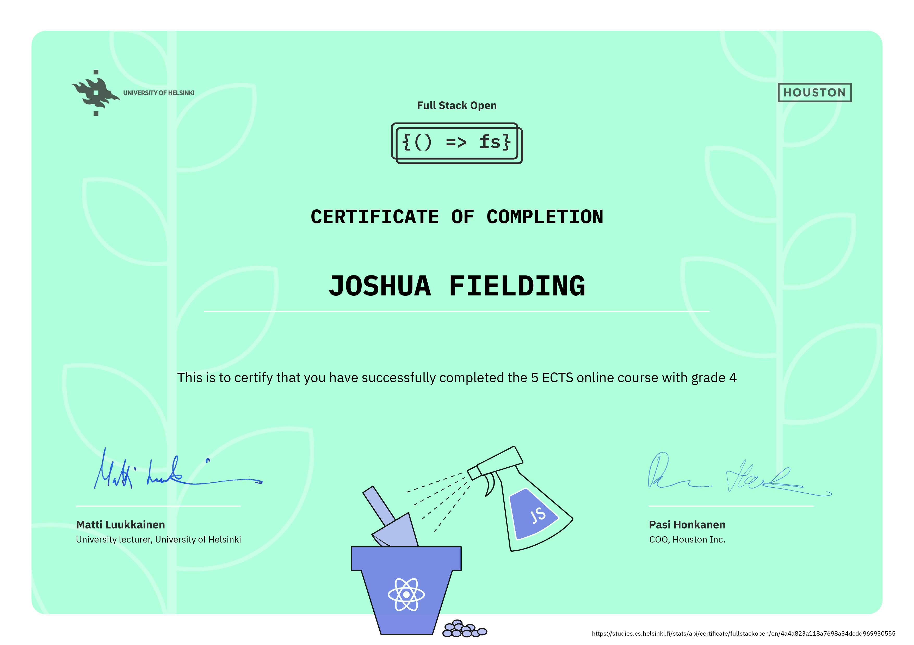

# [Full Stack Open 2023](https://fullstackopen.com/en/)

The repo is based on a course held at the [Department of Computer Science, University of Helsinki](https://www.helsinki.fi/en/admissions-and-education/open-university/multidisciplinary-themed-modules/full-stack), in collaboration with Open University.

It introducs fullstack modern JavaScript-based web development, primarily focusing on building Single Page Applications with React that use REST APIs built with Node.js.

Specific subjects are:

- React
- Redux
- Node.js
- MongoDB
- GraphQL
- TypeScript
- React Native
- GitHub Actions
- Docker

The repo is a WIP that contains my solutions to the various exercises. Parts 1-9 have been completed and marked by the university. Part 10 - the react native app - can be viewed in a separate repo [over here](https://github.com/luxjoshyua/FullStackOpen-part10-react-native).

### Certificate of Completion - Units 1 to 5

### [Part 0 - Fundamentals of Web apps](https://fullstackopen.com/en/part0)

- General Info
- Fundamentals of Web apps

### [Part 1 - Introduction to React](https://fullstackopen.com/en/part1)

- Introduction to React
- JavaScript
- Component State, event handlers
- A more complex state, debugging React apps

### [Part 2 - Communicating with server](https://fullstackopen.com/en/part2)

- Rendering a collection, modules
- Forms
- Getting data from server
- Altering data in server
- Adding style to React apps

### [Part 3 - Programming a server with NodeJS and Express](https://fullstackopen.com/en/part3)

- Node.js and Express
- Deploying app to internet - (deployed using [render - course](https://render-test-fu9h.onrender.com/) and [render - phonebook](https://part3-phonebook-xb4u.onrender.com/))
- Saving data to MongoDB
- Validation and ESLint

### [Part 4 - Testing Express servers, user administration](https://fullstackopen.com/en/part4)

- Structure of backend application, introduction to testing
- Testing and backend
- User administration
- Token administration

### [Part 5 - Testing React apps](https://fullstackopen.com/en/part5)

- Login in frontend
- props.children and proptypes
- Testing React apps
- End to end testing

### [Part 6 - State management with Redux](https://fullstackopen.com/en/part6)

- Flux-architecture and Redux
- Many reducers
- Communicating with server in a redux application
- Connect

### [Part 7 - React router, custom hooks, styling app with CSS and webpack](https://fullstackopen.com/en/part7)

- React-router
- Custom hooks
- More about styles
- Webpack
- Class components, Miscellaneous
- Exercises - extending the bloglist

### [Part 8 - GraphQL](https://fullstackopen.com/en/part8)

- GraphQL-server
- React and GraphQL
- Database and user administration
- Login and updating the cache
- Fragments and subscriptions

### [Part 9 - TypeScript](https://fullstackopen.com/en/part9)

- Background and introduction
- First steps with TypeScript
- Typing the express app
- React with types

### [Part 10 - React Native](https://fullstackopen.com/en/part10)

- Introduction to React Native
- React Native basics
- Communicating with server
- Testing and extending our application

### [Part 11 - CI/CD](https://fullstackopen.com/en/part11)

- Introduction to CI/CD
- Getting started with GitHub Actions
- Deployment
- Keeping green
- Expanding further

### [Part 12 - Containers](https://fullstackopen.com/en/part12)

- Introduction to containers
- Building and configuring environments
- Basics of Orchestration

### [Part 13 - Using relational databases](https://fullstackopen.com/en/part13)

- Using relational databases with Sequelize
- Join tables and queries
- Migrations, many-to-many relationships
